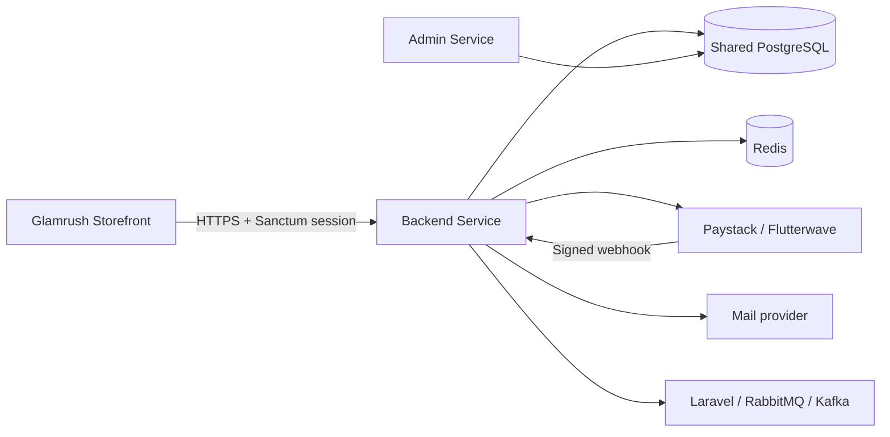
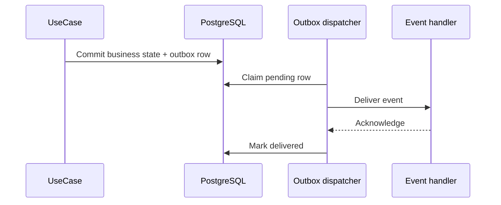

# Backend Service architecture

## Purpose

The Backend Service is the commerce runtime for all customer storefronts. It exposes public catalog/content APIs and authenticated customer operations while isolating provider integrations and persistence behind domain contracts.



## Layers

| Layer | Location | Responsibility |
| --- | --- | --- |
| Presentation | `app/Presentation` | Controllers, requests, middleware, and HTTP resources |
| Domain | `app/Domain` | Use cases, entities, contracts, rules, and domain events |
| Infrastructure | `app/Infrastructure` | Eloquent repositories, cache, event transports, outbox, settings, and payment providers |
| Shared | `app/Shared` | Cross-domain DTOs and event abstractions |

The preferred request flow is:

```text
Route -> middleware -> controller -> domain action/service -> domain contract
      -> infrastructure implementation -> resource/response
```

Repository contracts make persistence replaceable, but catalog, homepage, settings, discount, inventory, and checkout code still rely on the current shared database. Treat a move to service-to-service HTTP as an architectural migration, not a connection-string change.

## Storefront context and catalog

Every storefront route resolves an active root category. Product visibility is determined through product-category relationships beneath that root. Catalog queries provide search, filters, facets, sorting, pagination, effective variant pricing, media, and backward-compatible primary-category fields.

Products may belong to multiple categories through `category_product`. The primary category remains available as `category`/`primary_category`, while `categories` exposes all assignments.

Read-heavy responses use Redis query caching and short public HTTP cache headers. Shared cache-version records let Admin catalog mutations invalidate Backend namespaces after database commit.

## Identity and carts

Customer authentication uses Sanctum's stateful SPA mode and CSRF protection. The browser holds the session in an HttpOnly cookie. Google Socialite handles supported social token exchange.

Guest carts use a generated cart token sent in `X-Cart-Token`; authenticated carts use the customer identity. Cart merge is an explicit authenticated operation. Server-side validation always rechecks storefront membership, variant sellability, and available quantity.

## Checkout, inventory, and payments

Checkout currently executes a local database transaction that:

1. Enforces request idempotency.
2. Locks sellable variants in a deterministic order.
3. Verifies available stock and increments reserved quantities.
4. Resolves shipping and validates discounts.
5. Snapshots prices and targeting information onto order lines.
6. Creates the pending order and outbox records.

Payment initialization has its own idempotency boundary. Verification and signed webhooks converge on the same payment state transitions. Successful payment commits reserved inventory; failed or expired orders release it once. Payment callbacks must never trust query-string status alone.

See [Order and payment idempotency](order-payment-idempotency.md).

## Events and reliable delivery

Domain code publishes through an `EventBus` contract. Drivers are available for Laravel, RabbitMQ, and Kafka. Durable business notifications use the transactional outbox so records are committed atomically with state changes and dispatched asynchronously.



The scheduler runs `outbox:dispatch` and `orders:expire-pending`. External brokers additionally require the continuous `events:consume` process. See [Event bus](event-bus.md).

## Data ownership

Admin Service owns catalog, merchandising, content definitions, discounts, shipping configuration, payment-method configuration, and settings schema. Backend Service owns customer accounts, social accounts, saved items, carts, customer addresses, orders, order items, payments, transactions, redemptions, newsletter subscription writes, contact submissions, outbox messages, and consumed-event records.

Some runtime operations update Admin-owned catalog records, notably variant reservation/stock fields. Changes to these invariants require coordinated tests in both Laravel repositories.

## Security and resilience

- Stateful Sanctum + CSRF for first-party browser mutations
- Route-specific Redis-backed throttles for login, password reset, catalog, cart, checkout, payment, newsletter, contact, and webhooks
- Provider signature verification for webhooks
- Idempotency keys and distributed locks for checkout/payment creation
- Validation and storefront scoping at the API boundary and again in persistence rules
- Sensitive-setting redaction and environment fallback
- Sentry and structured Laravel logs for production diagnostics
- Cached public reads with live stock/price validation at checkout

## Deployment topology

A production deployment needs independently scalable HTTP, queue, scheduler, and optional event-consumer processes:

| Process | Command/purpose |
| --- | --- |
| HTTP | Octane or the platform's PHP runtime |
| Queue | `php artisan queue:work` |
| Scheduler | `php artisan schedule:run` every minute, or `schedule:work` in a dedicated process |
| Event consumer | `php artisan events:consume` for RabbitMQ/Kafka only |

Only one logical scheduler should operate per environment. Queue workers and Octane workers must be restarted after deployments. See [Octane Docker deployment](octane-docker-deployment.md).

## Testing strategy

Feature tests cover catalog filters, storefront homepages, carts, authentication, SPA security, discounts, settings, payments, caching, locations, newsletter, and content. Unit tests cover mappers, shipping quotes, query-cache behavior, invalidation, and event transports.

High-risk changes should include concurrency/idempotency tests and assertions that repeated callbacks or outbox delivery do not duplicate side effects.
